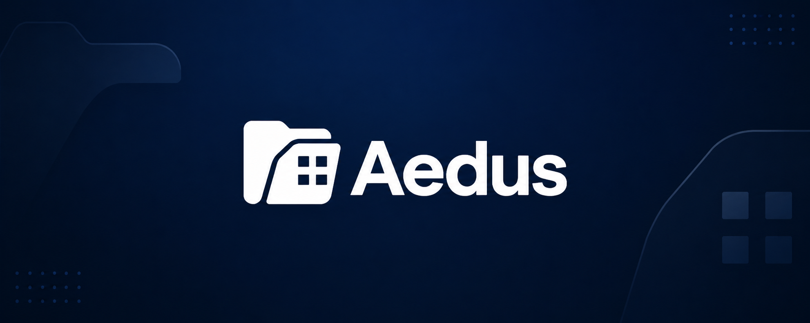

<div align="center">
  
</div>

<div align="center">
  <h1>🌐 AedusWeb</h1>
  <p>Incident management platform with real-time chat and AI classification</p>

  
  
  
  
  

  <br/><br/>

  <a href="https://aedus-web.vercel.app">
    
  </a>
</div>

---

## 📖 About

AedusWeb is a cross-platform application built with **Flutter** designed for professional team environments. It combines incident management, real-time communication, and AI-powered automation in a sleek dark-themed interface — available on web, Android, iOS, Windows, Linux and macOS.

---

## ✨ Features

- 📊 **Dashboard** — Metrics and charts for quick team overview
- 🤖 **AI Classification** — Automatic incident categorization powered by **Groq (LLaMA 3.3 70B)**
- 💬 **Real-time Chat** — Messaging system with contacts management
- 🎫 **Ticket System** — Create and manage tickets with image attachments and status tracking
- 🏆 **Gamification** — Points and achievements system to boost team engagement
- ☁️ **Cloud Storage** — Files and images stored in the cloud
- 🗄️ **PostgreSQL** — Robust relational database backend

---

## 🛠️ Tech Stack

| Technology | Purpose |
|---|---|
| Flutter | Cross-platform UI framework |
| Dart | Core language |
| Provider | State management |
| PostgreSQL | Database |
| Groq (LLaMA 3.3 70B) | AI incident classification |
| Font Awesome | Icon pack |
| Vercel | Web deployment |

---

## 🌍 Platforms

| Platform | Status |
|---|---|
| 🌐 Web | ✅ Deployed |
| 🤖 Android | ✅ Supported |
| 🍎 iOS | ✅ Supported |
| 🪟 Windows | ✅ Supported |
| 🐧 Linux | ✅ Supported |
| 🍏 macOS | ✅ Supported |

---

## 🚀 Getting Started

### Prerequisites

- Flutter SDK 3.x+
- Dart SDK
- PostgreSQL database
- Groq API key

### Installation

1. Clone the repository:
```bash
git clone https://github.com/marioovlc/AedusWeb.git
cd AedusWeb
```

2. Install dependencies:
```bash
flutter pub get
```

3. Create a `.env` file in the root:
```env
DB_URL=your_database_url
DB_USER=your_db_user
DB_PASS=your_db_password
AI_API_KEY=your_groq_api_key
AI_MODEL=llama-3.3-70b-versatile
```

4. Run the app:
```bash
# Web
flutter run -d chrome

# Android
flutter run -d android

# Windows
flutter run -d windows
```

---

## 📁 Project Structure

```
AedusWeb/
├── lib/                  # Main Dart source code
├── web/                  # Web platform files
├── android/              # Android platform files
├── ios/                  # iOS platform files
├── windows/              # Windows platform files
├── linux/                # Linux platform files
├── macos/                # macOS platform files
├── test/                 # Unit and widget tests
├── pubspec.yaml          # Flutter dependencies
├── vercel.json           # Vercel deployment config
└── .env                  # Environment variables (not committed)
```

---

## 🔗 Live Demo

Check out the deployed version at **[aedus-web.vercel.app](https://aedus-web.vercel.app)**
User: admin@aedus.es
Password: 1234

---

## 👤 Author

**Mario Fernández**

[](https://linkedin.com/in/mario-fernández-9417502a1)
[](https://github.com/marioovlc)

---

<div align="center">
  <sub>Built with 💙 Flutter · Deployed on Vercel</sub>
</div>
